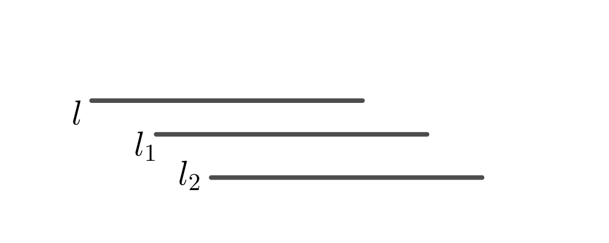

## 题目描述

明德小学的保安小明由于不满于自己的工资太低，辞职不干了。小明的离职让明德小学的校长非常头疼，明德小学只有小明一名保安，小明辞职以后值班室就没有人值班了。然而从时间点 $S$ 到时间点 $T$（包括 $S$ 和 $T$）值班室必须有人值班。

明德博士只能打老师们的主意了。明德小学有 $N$ 名老师，每名老师每天都会有一个时间段没有课程的休息时间，其中第 $i$ 名老师的休息时间是从 $A_i$ 到 $B_i$（包括 $A_i$ 和 $B_i$）。

明德博士便想让老师们通过接力的方式来值班。但是明德博士不知道能不能保证 $S$ 到 $T$ 的所有时间段都至少有一名老师在值班，如果可以保证的话，为了尽量不影响老师们的教学工作，他希望值班老师的总数量越少越好。请你帮帮明德博士吧。

## 输入格式

第 $1$ 行：$3$ 个空格分隔的整数 $N$，$S$ 和 $T$。$(1 \leq N \leq 10000，0 \leq S \leq T \leq 1000000)$

接下来 $N$ 行：每行 $2$ 个空格分隔的整数 $A$ 和 $B$，表示一名老师的休息时间是 $A$ 到 $B$。

## 输出格式

一行：一个整数，表示最少需要几名老师，可以保证 $S$ 到 $T$ 的任意时刻都有老师在值班，如果无论如何都无法保证 $S$ 到 $T$ 任一时刻都有老师值班输出 $-1$。为了计算方便假设换班不需要时间。

## 输入输出样例

### 输入样例1

```plaintext
3 1 10
1 5
4 6
6 10
```

### 输出样例1

```plaintext
2
```

## 题解 

本题是区间覆盖问题。



如上图，