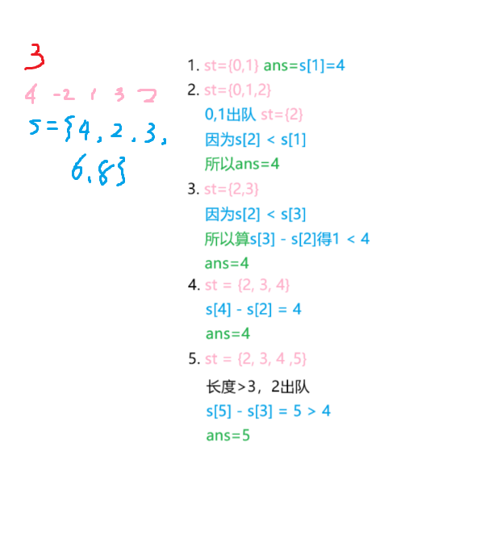

# T1. [[NOIP2010 提高组] 机器翻译](https://www.luogu.com.cn/problem/P1540)

## 题目背景

NOIP2010 提高组 T1

## 题目描述

小晨的电脑上安装了一个机器翻译软件，他经常用这个软件来翻译英语文章。

这个翻译软件的原理很简单，它只是从头到尾，依次将每个英文单词用对应的中文含义来替换。对于每个英文单词，软件会先在内存中查找这个单词的中文含义，如果内存中有，软件就会用它进行翻译；如果内存中没有，软件就会在外存中的词典内查找，查出单词的中文含义然后翻译，并将这个单词和译义放入内存，以备后续的查找和翻译。

假设内存中有 $M$ 个单元，每单元能存放一个单词和译义。每当软件将一个新单词存入内存前，如果当前内存中已存入的单词数不超过 $M-1$，软件会将新单词存入一个未使用的内存单元；若内存中已存入 $M$ 个单词，软件会清空最早进入内存的那个单词，腾出单元来，存放新单词。

假设一篇英语文章的长度为 $N$ 个单词。给定这篇待译文章，翻译软件需要去外存查找多少次词典？假设在翻译开始前，内存中没有任何单词。

## 输入格式

共 $2$ 行。每行中两个数之间用一个空格隔开。

第一行为两个正整数 $M,N$，代表内存容量和文章的长度。

第二行为 $N$ 个非负整数，按照文章的顺序，每个数（大小不超过 $1000$）代表一个英文单词。文章中两个单词是同一个单词，当且仅当它们对应的非负整数相同。

## 输出格式

一个整数，为软件需要查词典的次数。

## 样例 #1

### 样例输入 #1

```
3 7
1 2 1 5 4 4 1
```

### 样例输出 #1

```
5
```

## 提示

### 样例解释

整个查字典过程如下：每行表示一个单词的翻译，冒号前为本次翻译后的内存状况：

1. `1`：查找单词 1 并调入内存。
2. `1 2`：查找单词 2 并调入内存。
3. `1 2`：在内存中找到单词 1。
4. `1 2 5`：查找单词 5 并调入内存。
5. `2 5 4`：查找单词 4 并调入内存替代单词 1。
6. `2 5 4`：在内存中找到单词 4。
7. `5 4 1`：查找单词 1 并调入内存替代单词 2。

共计查了 $5$ 次词典。

### 数据范围

- 对于 $10\%$ 的数据有 $M=1$，$N \leq 5$；
- 对于 $100\%$ 的数据有 $1 \leq M \leq 100$，$1 \leq N \leq 1000$。

## 思路
用队列模拟，有的单词不管，没有的单词入队后判断队伍长度，越界就出开头的。

### 代码
```c++
#include <iostream>
#include <queue>
using namespace std;

int Hash[1001] = {0};
queue<int> mem;
int m, n, cnt = 0, word;

int main() {
    cin >> m >> n;
    while(n--) {
        cin >> word;
        if(!Hash[word]) {
            ++cnt;  //新单词，查一次
            mem.push(word); //入队
            Hash[word] = 1; //记到内存中
            while(mem.size() > m) {     //内存超限了
                Hash[mem.front()] = 0;  //删除单词
                mem.pop();              //队首出队
            }
        }
    }
    cout << cnt;
    return 0;
}
``` 


# T2. [滑动窗口 /【模板】单调队列](https://www.luogu.com.cn/problem/P1886)

## 题目描述

有一个长为 $n$ 的序列 $a$，以及一个大小为 $k$ 的窗口。现在这个从左边开始向右滑动，每次滑动一个单位，求出每次滑动后窗口中的最大值和最小值。

例如，对于序列 $[1,3,-1,-3,5,3,6,7]$ 以及 $k = 3$，有如下过程：

$$\def\arraystretch{1.2}
\begin{array}{|c|c|c|}\hline
\textsf{窗口位置} & \textsf{最小值} & \textsf{最大值} \\ \hline
\verb![1   3  -1] -3   5   3   6   7 ! & -1 & 3 \\ \hline
\verb! 1  [3  -1  -3]  5   3   6   7 ! & -3 & 3 \\ \hline
\verb! 1   3 [-1  -3   5]  3   6   7 ! & -3 & 5 \\ \hline
\verb! 1   3  -1 [-3   5   3]  6   7 ! & -3 & 5 \\ \hline
\verb! 1   3  -1  -3  [5   3   6]  7 ! & 3 & 6 \\ \hline
\verb! 1   3  -1  -3   5  [3   6   7]! & 3 & 7 \\ \hline
\end{array}
$$

## 输入格式

输入一共有两行，第一行有两个正整数 $n,k$。
第二行 $n$ 个整数，表示序列 $a$

## 输出格式

输出共两行，第一行为每次窗口滑动的最小值   
第二行为每次窗口滑动的最大值

## 样例 #1

### 样例输入 #1

```
8 3
1 3 -1 -3 5 3 6 7
```

### 样例输出 #1

```
-1 -3 -3 -3 3 3
3 3 5 5 6 7
```

## 提示

【数据范围】    
对于 $50\%$ 的数据，$1 \le n \le 10^5$；  
对于 $100\%$ 的数据，$1\le k \le n \le 10^6$，$a_i \in [-2^{31},2^{31})$。

## 思路
用单调队列，右移一位就删头、去尾

### 代码-STL deque
```c++
#include <iostream>
#include <queue>
using namespace std;

const int N = 10000001;
int a[N] = {0};
deque<int> q;       //双端队列
int n, m;

int main() {
    cin >> n >> m;
    for(int i = 1; i <= n; i++) cin >> a[i];
    for(int i = 1; i <= n; i++) {
        while(!q.empty() && a[q.back()] > a[i]) q.pop_back();  //去尾（破坏了单调性）
        q.push_back(i);
        cout << a[q.front()] << " ";
        if(i >= m) {
            while(!q.empty() && a[q.front()] <= i - m) q.pop_front();  //删头（头不在窗口中）
            cout << a[q.front()] << " ";
        }
    }
    cout << endl;
    while(!q.empty()) q.pop_front();
    for(int i = 1; i <= n; i++) {
        while(!q.empty() && a[q.back()] < a[i]) q.pop_back();  //去尾（破坏了单调性）
        q.push_back(i);
        cout << a[q.front()] << " ";
        if(i >= m) {
            while(!q.empty() && a[q.front()] <= i - m) q.pop_back();  //删头（头不在窗口中）
            cout << a[q.front()] << " ";
        }
    }

    return 0;
}
```

# T3. Max Sum(hdu 1003)

## 问题描述
给定一个序列 a[1], a[2], a[3], ..., a[n]，你的任务是计算子序列的最大和。例如，给定 (6, -1, 5, 4, -7)，这个序列的最大和是 6 + (-1) + 5 + 4 = 14。

## 输入
输入的第一行包含一个整数 T(1<=T<=20)，表示测试用例的数量。接下来的 T 行，每行以一个数字 N(1<=N<=100000) 开始，然后是 N 个整数（所有整数都在 -1000 到 1000 之间）。

## 输出
对于每个测试用例，你应该输出两行。第一行是 "Case #:"，# 表示测试用例的编号。第二行包含三个整数，序列中的最大和，子序列的起始位置，子序列的结束位置。如果有多个结果，输出第一个。两个案例之间输出一个空行。

## 样例输入 #1
```
2
5 6 -1 5 4 -7
7 0 6 -1 1 -6 7 -5
```
## 样例输出 #1 
```
Case 1:
14 1 4

Case 2:
7 1 6
```

## 题解
动态规划，以dp[i]表示从0到i的最大子序列和。状态转移方程为:dp[i] = max(dp[i - 1] + dp[i], dp[i])，意思是如果上一个数和最大的子序列中加入了第i个数，如果结果更大就确定加入，否则当前的一个数是整个序列的最大子序列和。

### 代码
```c++
#include <iostream>
using namespace std;

int dp[100001];
int t, n;

int main() {
    cin >> t;
    while(t--) {
        cin >> n;
        for(int i = 1; i <= n; i++) cin >> dp[i];
        int s, e, p, max = dp[1];
        s = e = p = 1;
        //dp
        for(int i = 2; i <= n; i++) {
            if(dp[i - 1] + dp[i] >= dp[i]) dp[i] = dp[i - 1] + dp[i];
            else p = i;
            if(dp[i] > max) max = dp[i], s = p, e = i;    //(p, i)是和最大的子序列
        }
        cout << max << " " << s << " " << e << endl;
        cout << endl;
    }
}
```

# T4 

## 题目描述
限制子序列的长度m，找出一段长度不超过m的子序列，使它的子序列和最大

## 题解
首先求前缀和，找出i, k，使得s[i] - s[k]最大(i - k <= m)

用滑动窗口的思想模拟：
- 将s[1]入队，ans为s[1]
- 将s[2]入队
    - 若s[1] <= s[2]，则ans = max{s[1], s[2], s[2] - s[1]}; //取(1), (1, 2), (2)三个子序列的和的最大值
    - 若s[1] > s[2]，则ans = s[1]，然后将s[1]出队，保留s[2] //因为s[i'] - s[2]必然大于s[i'] - s[1]



总结步骤:
将s[i]放入队列
1. 把队列内比s[i]大的s[j]都出队(i - j <= m)  //保证s[i'] - s[i] > s[i'] - s[j]
2. 若队列内s[k]最小，则s[k] < s[i]，检查s[k] < s[i]是否大于ans
    - 大于：更新
    - 不大于：不更新

## 代码
```c++
#include <iostream>
#include <queue>
using namespace std;
const int N = 10001;
deque<int> st;
int a[N], s[N] = {0}, n, m;

int main() {
    cin >> n >> m;
    for(int i = 1; i <= n; i++) {
        cin >> a[i];
        s[i] = s[i - 1] + a[i];
    }
    int ans = -1e8;
    st.push_back(0);
    for(int i = 1; i <= n; i++) {   //每个s[i]依次入队
        while(!st.empty() && st.front() < i - m) st.pop_front();    //长度超过m，删除头
        if(st.empty()) ans = s[1]; else ans = max(ans, s[i] - s[st.front()]);
        while(!st.empty() && s[st.back()] >= s[i]) st.pop_back();   //维护单调队列，使得s[i'] - s[k]最大
        st.push_back(i);
    }
    cout << ans;
    return 0;
}
```

# [求m区间内的最小值](https://www.luogu.com.cn/problem/P1440)

## 题目描述

一个含有 $n$ 项的数列，求出每一项前的 $m$ 个数到它这个区间内的最小值。若前面的数不足 $m$ 项则从第 $1$ 个数开始，若前面没有数则输出 $0$。

## 输入格式

第一行两个整数，分别表示 $n$，$m$。

第二行，$n$ 个正整数，为所给定的数列 $a_i$。

## 输出格式

$n$ 行，每行一个整数，第 $i$ 个数为序列中 $a_i$ 之前 $m$ 个数的最小值。

## 样例 #1

### 样例输入 #1

```
6 2
7 8 1 4 3 2
```

### 样例输出 #1

```
0
7
7
1
1
3
```

## 提示

对于 $100\%$ 的数据，保证 $1\le m\le n\le2\times10^6$，$1\le a_i\le3\times10^7$。

## 代码
```c++
#include <iostream>
#include <stdio.h>
#include <queue>
using namespace std;

const int N = 2 * 1000000 + 1;
int a[N], n, m;
deque<int> dq;

int main() {
    scanf("%d %d", &n, &m);
	a[0] = 0;
	dq.push_back(0);
    for(int i = 1; i <= n; i++) {
        scanf("%d", &a[i]);
        while(!dq.empty() && i - dq.front() > m) dq.pop_front();    //删头
        while(!dq.empty() && a[dq.back()] >= a[i]) dq.pop_back();   //去尾
		printf("%d\n", a[dq.front()]);
		if(dq.front() == 0) dq.pop_front();
        dq.push_back(i);
    }
    return 0;
}
```

# [扫描](https://www.luogu.com.cn/problem/P2032)
## 题目描述

有一个 $1 \times n$ 的矩阵，有 $n$ 个整数。

现在给你一个可以盖住连续 $k$ 个数的木板。

一开始木板盖住了矩阵的第 $1 \sim k$ 个数，每次将木板向右移动一个单位，直到右端与第 $n$ 个数重合。

每次移动前输出被覆盖住的数字中最大的数是多少。

## 输入格式

第一行两个整数 $n,k$，表示共有 $n$ 个数，木板可以盖住 $k$ 个数。

第二行 $n$ 个整数，表示矩阵中的元素。

## 输出格式

共 $n - k + 1$ 行，每行一个整数。

第 $i$ 行表示第 $i \sim i + k - 1$ 个数中最大值是多少。

## 样例 #1

### 样例输入 #1

```
5 3
1 5 3 4 2
```

### 样例输出 #1

```
5
5
4
```

## 提示

对于 $20\%$ 的数据，$1 \leq k \leq n \leq 10^3$。

对于 $50\%$ 的数据，$1 \leq k \leq n \leq 10^4$。

对于 $100\%$ 的数据，$1 \leq k \leq n \leq 2 \times 10^6$，矩阵中的元素大小不超过 $10^4$ 并且均为正整数。

## 代码
```c++
#include <iostream>
#include <stdio.h>
#include <queue>
using namespace std;

const int N = 2 * 1000000 + 1;
int a[N], n, k, s = 1, e = 1;
deque<int> dq;

int main() {
    scanf("%d %d", &n, &k);
    for(int i = 1; i <= n; i++) 
        scanf("%d", &a[i]);
    for(int i = 1; i <= n; i++, e++) {
        while(!dq.empty() && i - dq.front() == k) dq.pop_front();   //删头
        while(!dq.empty() && a[dq.back()] <= a[i]) dq.pop_back();   //去尾
        dq.push_back(i);
		if(i >= k) printf("%d\n", a[dq.front()]);
    }
    return 0;
}
```